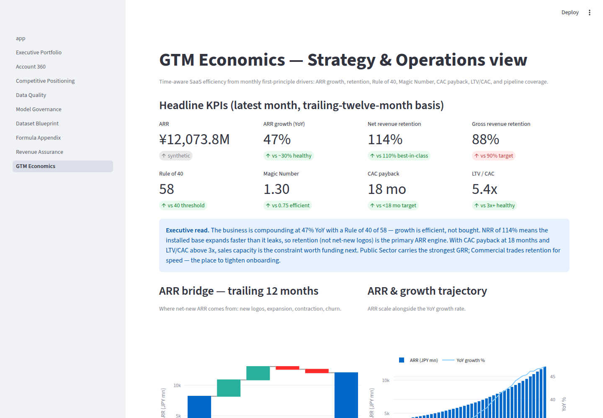
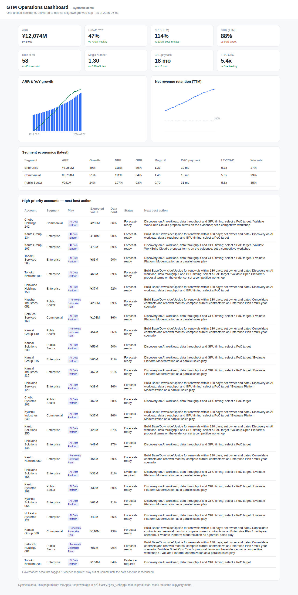
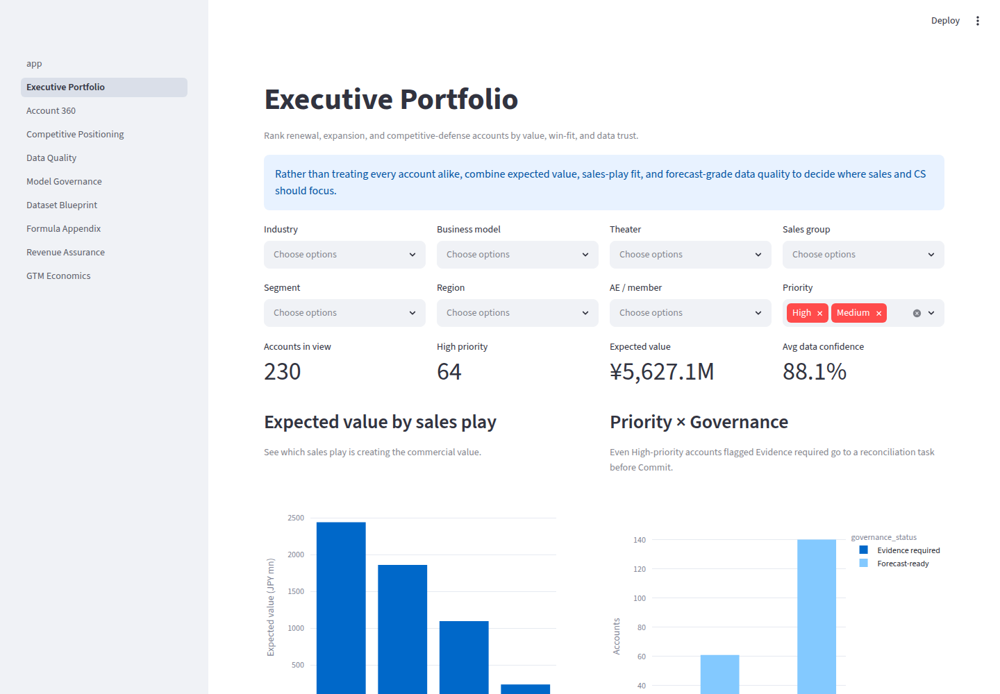
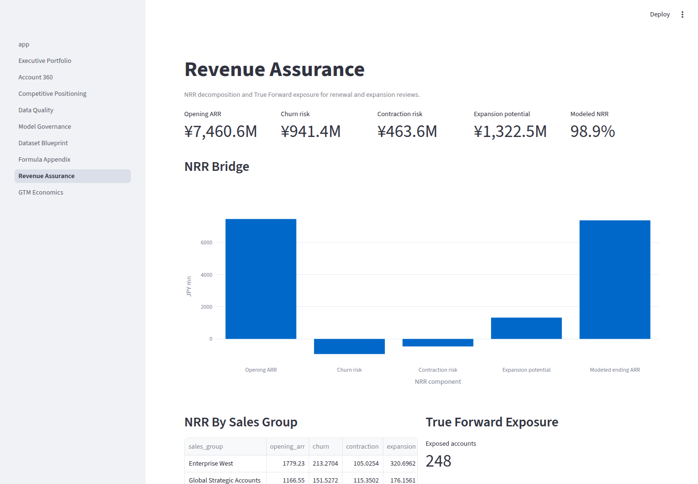
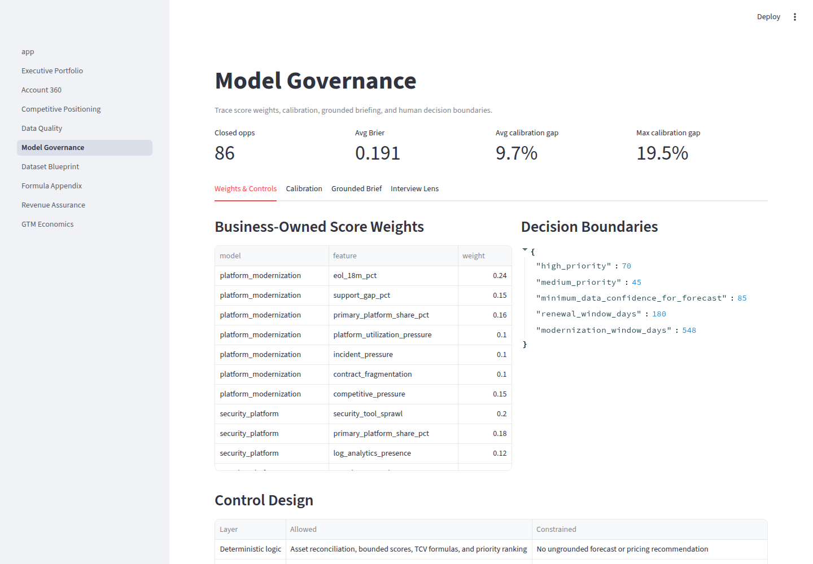
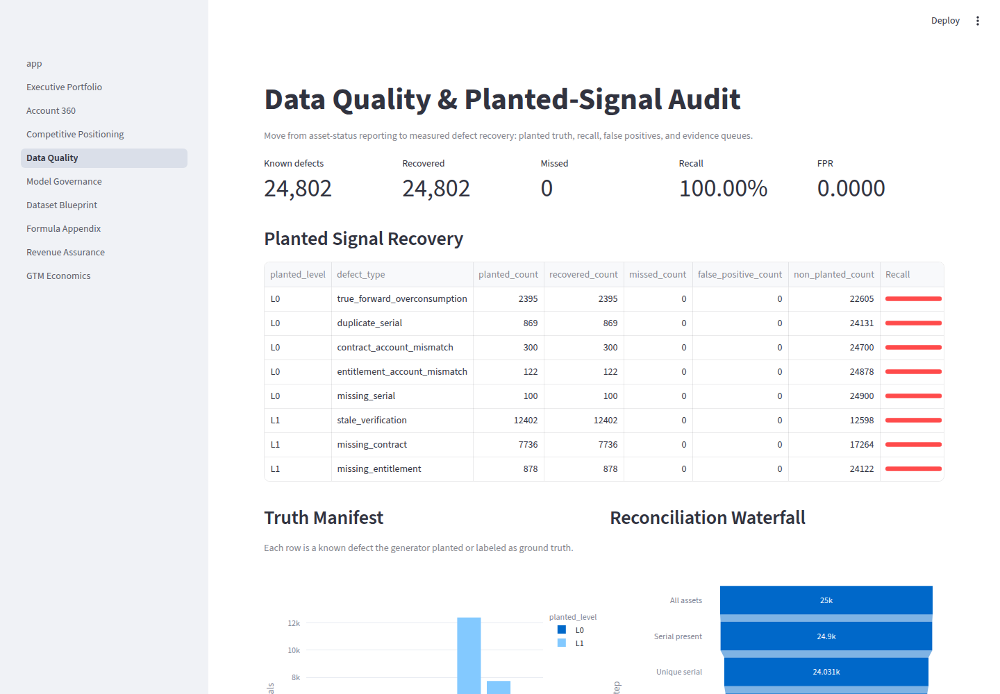

# Enterprise SaaS Insights Lab

**A unified, time-aware GTM analytics backbone — one source of truth, delivered to
every audience in the form it actually uses.** Built as a Strategy & Operations /
BizOps portfolio: it turns synthetic enterprise-SaaS data into the metrics an
executive staff runs on (ARR growth, NRR/GRR, Rule of 40, Magic Number, CAC
payback, LTV/CAC) and the account-level actions a field team executes on — with a
governance boundary kept intact end to end.


&nbsp;Python 3.11+ · DuckDB · Streamlit · 100% synthetic data · zero-cost stack

> All data is synthetic and generated from a fixed seed. No employer, customer,
> pricing, credential, or personal data is used anywhere in this repository.

---

## The 30-second version

Most analytics portfolios stop at a dashboard. Real BizOps work is harder: get
**one trusted number to execs, analysts, ops, and field sales at once**, keep the
definitions from drifting, and never let a pretty chart override a governance
rule. This project shows that full chain — model once in the warehouse, deliver
through four surfaces, agree always.

| What a hiring manager looks for | Where it is in this repo |
|---|---|
| Fluency in SaaS / GTM economics | **GTM Economics** page · `src/saas_insights/gtm.py` |
| From data → decision, not just a chart | Executive Portfolio + grounded next-best-action |
| Metric discipline (no two decks disagree) | Metrics defined once; Looker/AppSheet/ops all *read* them |
| Engineering that scales | DuckDB↔BigQuery-portable SQL, tests, CI, typed Python |
| Judgment & governance | Forecast-eligibility gate, score drivers, calibration, citations |

## GTM Economics — the Strategy & Ops view

Time-aware SaaS efficiency, every KPI reconstructed from monthly first-principle
drivers (new / expansion / contraction / churn ARR, spend, customers, funnel) so
each number is auditable and reproduces from the seed — not hard-coded.



Headline KPIs are shown against the benchmarks an operator actually quotes
(Rule of 40 ≥ 40, Magic Number ≥ 0.75, NRR ≥ 110% best-in-class, CAC payback
< 18 months, LTV/CAC ≥ 3x), with an executive read that says *what to do next*.

## One backbone, many surfaces

```
        Unified backbone (BigQuery in prod / DuckDB locally — identical SQL)
        raw → staging → reconciliation → account marts + time-aware GTM marts
                                   │   one definition of ARR / NRR / Rule of 40 …
        ┌──────────────┬──────────┴───────────┬────────────────────┐
        ▼              ▼                        ▼                    ▼
   Looker         Streamlit app         Apps Script web app     AppSheet
   execs/analysts analysts/interview    operations teams        field sales
```

The same governed marts feed all four. See
[`docs/reference_architecture.md`](docs/reference_architecture.md) and
[`delivery/`](delivery/). The operations surface is a **self-contained,
dependency-free HTML dashboard** (native Canvas charts, works offline) — the kind
of lightweight Apps Script app that reaches teams a heavyweight BI tool never does:



## What else is in the lab

| Page | Decision it supports | |
|---|---|---|
| **GTM Economics** | Is growth efficient? Where to fund next? |  |
| **Executive Portfolio** | Which accounts get sales/CS attention, by value + win-fit + data trust |  |
| **Revenue Assurance** | NRR decomposition + True Forward exposure |  |
| **Model Governance** | Weights, calibration (Brier), grounded briefs, human approval |  |
| **Data Quality** | Planted-defect recall / FPR — *measured*, not asserted |  |

Also: Account 360, Competitive Positioning, Dataset Blueprint, Formula Appendix.

## Quick start (zero cost, ~1 minute)

```bash
python -m venv .venv && source .venv/bin/activate   # Windows: .venv\Scripts\activate
python -m pip install -e ".[dev]"
python -m saas_insights.cli bootstrap --accounts 250 --assets 25000 --seed 42
streamlit run app.py                                 # open http://localhost:8501
```

Build the offline ops dashboard:

```bash
python scripts/build_delivery_dashboard.py
# open delivery/gas_webapp/dashboard.html in any browser
```

### Deploy a live demo for free

[](https://share.streamlit.io/deploy?repository=dkamehat/enterprise-saas-insights-lab&branch=main&mainModule=app.py)

One click on the badge (sign in with GitHub — free) deploys this repo on
[Streamlit Community Cloud](https://share.streamlit.io) with `app.py` as the entry
point and dependencies from `requirements.txt`. On first load, click **Build
synthetic demo warehouse** to generate the data. No paid services required.

## Engineering

```bash
pytest          # unit + end-to-end pipeline tests
ruff check .    # lint
make bootstrap  # generate data + build warehouse
make app        # run dashboard
```

CI (`.github/workflows/ci.yml`) runs ruff, pytest, and a bootstrap+validate on
every push. The scoring/GTM/reconciliation logic is config-driven and covered by
tests so every number is reproducible.

## Data & privacy

- **100% synthetic**, generated deterministically from a seed.
- No real vendor/customer names, production pricing, credentials, PII, or live
  adapters. Disclaimer ships in the `dataset_meta` table.
- Generated CSV/DuckDB artifacts are git-ignored; the offline HTML dashboard and
  screenshots commit synthetic values only.

## Repository layout

```text
src/saas_insights/  generator, pipeline, scoring, GTM economics, briefing, TCO
sql/                staging, reconciliation, account features, GTM marts, views
pages/              Streamlit decision-support pages (incl. GTM Economics)
delivery/           Looker (LookML), Apps Script web app, AppSheet spec
docs/               architecture, reference architecture, data dictionary, MBR memo
scripts/            warehouse export, delivery dashboard build, screenshot capture
tests/              unit + integration tests
```

Author: [github.com/dkamehat](https://github.com/dkamehat) · vendor-neutral,
synthetic, and intentionally portable to a production BigQuery + Looker stack.
